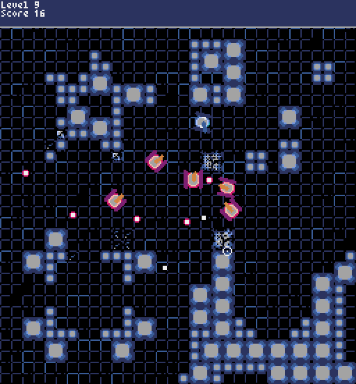
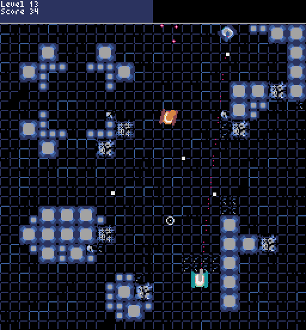
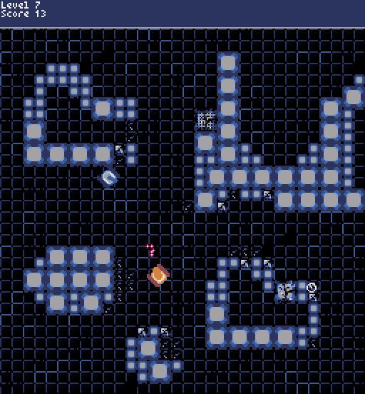
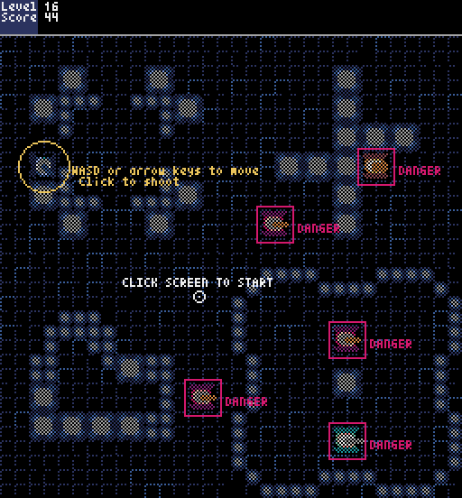
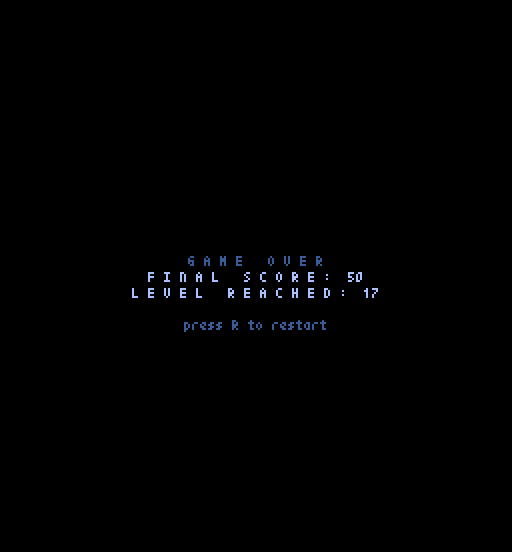

# TANK YOU

A retro-style 2D tank shooter built with [Pyxel](https://github.com/kitao/pyxel). Battle through endless randomly-generated levels, destroy enemy tanks, and survive as long as you can.



## Features

- **Procedurally generated levels** — four map chunks are randomly assembled each round
- **Three enemy types**, each with unique stats, AI behavior, and shooting patterns
- **Destructible environment** — boxes take damage and break apart
- **Scaling difficulty** — more (and tougher) enemies as levels increase
- **Visual feedback** — screen rumble on hit, health bar animation, dither effects

## Enemies

| Type | Behavior |
|------|----------|
| Red | Moderate speed, basic shot with slight spread |
| Brown | Fires a spread of 6 bullets at once, half damage each |
| Green | Slow, high damage (2×), shows a targeting line when locking on |



## Levels

Each level assembles four random map chunks into a 256×256 arena. Boxes are destructible — shoot through them to open new paths or cut off enemies.



## Start Screen & Death Screen




## Requirements

- Python 3.10+
- [Pyxel](https://github.com/kitao/pyxel)

```
pip install pyxel
```

## How to Run

```
python main.py
```

## Controls

| Input | Action |
|-------|--------|
| Arrow keys / WASD | Move and rotate tank |
| Mouse | Aim |
| Left click | Shoot |
| R | Restart after death |

## About the Code

Written in 2024, almost entirely by hand. AI was only used for generating a few trivial utility functions (collision math helpers, etc.) — all game logic, AI behavior, level generation, and architecture is original.

## Project Structure

```
tankgame/
├── main.py              # Game loop and application entry point
├── tank.py              # Tank, Enemy, and Projectile classes
├── world.py             # Map generation and destructible boxes
├── ui.py                # HUD, crosshair, death/pause screens
└── tank_sprites.pyxres  # Pyxel resource file (sprites, tilemaps, sounds)
```
